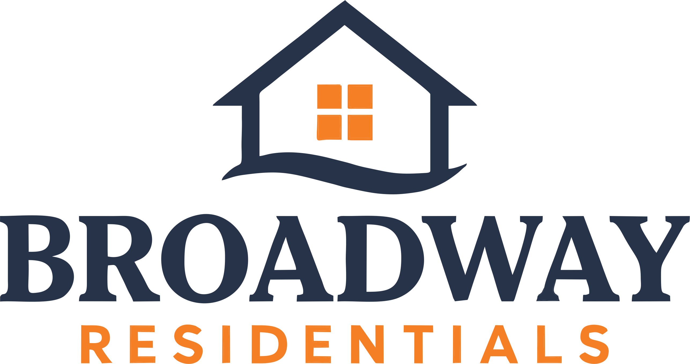

# EVC Broadway — Digital Estate Brochure



An interactive, high-performance digital brochure web application for **Broadway Residentials** developed by **EVC**.

## 🌟 Features
- **360° Interactive House Tour**: Interactive preview of the 2-Bedroom Bungalow floorplan & elevation plates.
- **Key Highlights & Rate Cards**: Overview of plot sizes, investment yields, and estate features.
- **Location Orbit & Neighborhood Accessibility**: Interactive distance map showing key landmarks near Malete.
- **Residences & Interiors Showcase**: Curated high-resolution imagery and specifications.
- **Pricing & Flexible Capsules**: Comprehensive payment breakdown and instalment plans.
- **Responsive & Animated UI**: Smooth Motion animations, interactive drawer components, and gate entry.

---

## 🛠️ Technology Stack
- **Framework**: [Vite](https://vitejs.js.org/) + [React 18](https://react.dev/)
- **Animations**: [Motion](https://motion.dev/)
- **Styles**: Custom Design System (`brochure.css` & `tokens.js`)

---

## 🚀 Getting Started

### Prerequisites
- Node.js (v18 or higher)
- npm or yarn

### Installation
```bash
# Clone the repository
git clone https://github.com/YOUR_USERNAME/EVC-Broadway.git

# Navigate to the project directory
cd EVC-Broadway

# Install dependencies
npm install

# Run the development server
npm run dev
```

---

## 📦 Deploying to Vercel

### Option 1: Via Vercel Dashboard (Recommended)
1. Push this repository to GitHub.
2. Go to [Vercel Dashboard](https://vercel.com/dashboard) and click **"Add New..." -> "Project"**.
3. Import the `EVC-Broadway` GitHub repository.
4. Set the **Project Name** to `evc-broadway` (or `EVC Broadway`).
5. Select **Vite** as the framework preset.
6. Click **Deploy**.

### Option 2: Via Vercel CLI
```bash
# Install Vercel CLI globally
npm install -g vercel

# Deploy directly
vercel --prod
```

---

## 💻 Commands Summary
| Command | Action |
| --- | --- |
| `npm run dev` | Starts local development server at `http://localhost:5173` |
| `npm run build` | Builds production output into `/dist` |
| `npm run preview` | Previews production build locally |

---

© EVC Broadway Residentials. All rights reserved.
